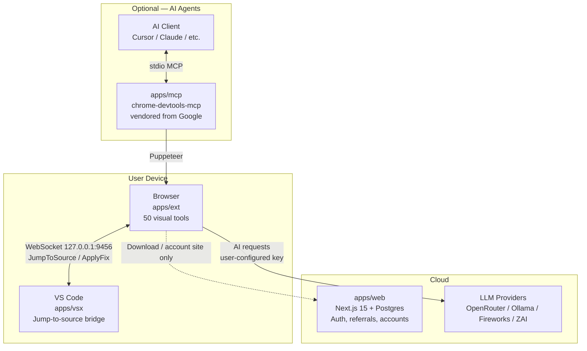

# Frontend Dev Helper

> 50 professional visual debugging tools in one Manifest V3 browser
> extension — plus a VS Code bridge, an AI agent surface, and a free
> marketing/account site.

[](.github/workflows/web-ci.yml)

**Frontend Dev Helper** is a Bun + Turborepo monorepo that ships **four
surfaces** working together: a flagship browser extension, a VS Code bridge
extension, a Next.js marketing/account web app, and a vendored Chrome DevTools
MCP server that exposes Chrome control to AI agents.

All first-party code is **free and open source (MIT)**. There are no paid
tiers, license keys, or subscriptions.

---

## What's in this monorepo?



| App                   | Path                   | What it is                                                                                                                               |
| --------------------- | ---------------------- | ---------------------------------------------------------------------------------------------------------------------------------------- |
| **Browser extension** | [`apps/ext`](apps/ext) | WXT + React 19 + shadcn/ui + Zustand. 50 tools across Inspection, CSS, Performance, A11y, AI, Utilities. Manifest V3, Chrome + Firefox. |
| **VS Code extension** | [`apps/vsx`](apps/vsx) | WebSocket bridge on `127.0.0.1:9456`. Receives jump-to-source, apply-fix, publish-diagnostics messages from the browser extension.        |
| **Web app**           | [`apps/web`](apps/web) | Next.js 15 marketing site, NextAuth (Credentials + Google + GitHub), Postgres via Prisma, Resend email, referral program, dashboard.     |
| **MCP server**        | [`apps/mcp`](apps/mcp) | Vendored Google `chrome-devtools-mcp` — optional AI-agent surface (not required for the extension).                                      |

Shared packages:

| Package                      | Path                                                             | What it is                                                        |
| ---------------------------- | ---------------------------------------------------------------- | ----------------------------------------------------------------- |
| `@repo/bridge-protocol`      | [`packages/bridge-protocol`](packages/bridge-protocol)           | Zod wire protocol + auth handshake for ext ↔ vsx.                 |
| `@repo/profiler-contract`    | [`packages/profiler-contract`](packages/profiler-contract)       | React profiler data contract (types + Zod schemas).               |
| `@repo/profiler-analyzer`    | [`packages/profiler-analyzer`](packages/profiler-analyzer)       | Pure analysis engine for React profiling data.                    |
| `@repo/eslint-config`        | [`packages/eslint-config`](packages/eslint-config)               | Shared ESLint flat configs (`base`, `next-js`, `react-internal`). |
| `@repo/typescript-config`    | [`packages/typescript-config`](packages/typescript-config)       | Shared `tsconfig.json` bases.                                     |

The extension does **not** call the web app for license or referral APIs.
Accounts and referrals live only on the marketing/account site.

---

## Quickstart

**Prerequisites:** Node 22+ (see [`.nvmrc`](.nvmrc)), Bun 1.3+.

```sh
# 1. Install
git clone <this-repo> frontend-dev-helper
cd frontend-dev-helper
bun install

# 2. Configure the web app (only apps/web needs env vars)
cp apps/web/.env.example apps/web/.env
# Fill in DATABASE_URL, NEXTAUTH_SECRET, RESEND_API_KEY, etc.
# Production also requires UPSTASH_REDIS_REST_URL / UPSTASH_REDIS_REST_TOKEN.

# 3. Run everything in dev (parallel across all workspaces)
bun run dev
```

### Run a single app

```sh
bun run dev --filter=frontend-dev-helper-web   # marketing/account site at http://localhost:7393
bun run dev --filter=frontend-dev-helper       # browser extension via WXT HMR
bun run dev --filter=fdh-vsx                   # VS Code extension host
bun run dev --filter=chrome-devtools-mcp       # optional MCP server
```

### Build, lint, type-check

```sh
bun run build         # turbo run build
bun run lint          # turbo run lint
bun run check-types   # turbo run check-types
bun run format        # prettier --write "**/*.{ts,tsx,md}"
```

For per-app deep dives, see:

- [`apps/ext/README.md`](apps/ext/README.md) — extension build, load-unpacked, tool authoring
- [`apps/web/README.md`](apps/web/README.md) — web app env vars, deploy, migrations
- [`apps/vsx/README.md`](apps/vsx/README.md) — VS Code extension dev + bridge protocol
- [`apps/mcp/README.md`](apps/mcp/README.md) — Google's chrome-devtools-mcp server docs

---

## Documentation

- **Audit & roadmap** — [`AUDIT.md`](AUDIT.md) and [`MASTER_PLAN.md`](MASTER_PLAN.md)
- **Extension audit** — [`AUDIT_EXT.md`](AUDIT_EXT.md), [`MASTER_PLAN_EXT.md`](MASTER_PLAN_EXT.md)
- **Architecture & contributing per app** — see each app's `README.md` and `CLAUDE.md`
- **Security** — [`apps/mcp/SECURITY.md`](apps/mcp/SECURITY.md) covers the MCP server
  (upstream telemetry default-on; set `CHROME_DEVTOOLS_MCP_NO_USAGE_STATISTICS` to opt out).
  Web app security model is documented in [`apps/web/README.md`](apps/web/README.md)

---

## License

- `apps/mcp` — Apache-2.0 (Google LLC, vendored upstream)
- All other code in this monorepo — [MIT](LICENSE)

## Acknowledgements

- [`chrome-devtools-mcp`](https://github.com/ChromeDevTools/chrome-devtools-mcp) by Google
- [WXT](https://wxt.dev) — Web Extension Toolkit
- [shadcn/ui](https://ui.shadcn.com) — UI components
